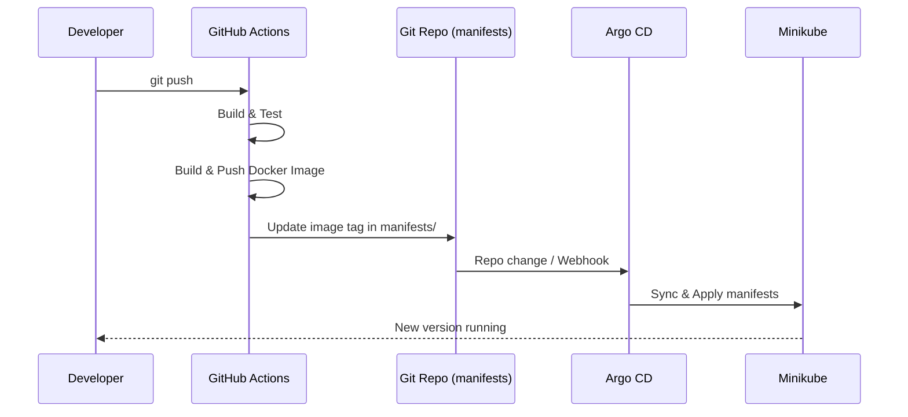

# Machine Efficiency Prediction (End‑to‑End MLOps)

> **TL;DR**: A production‑ready pipeline that predicts **machine efficiency status** (`High` / `Medium` / `Low`) from telemetry (temperature, vibration, power use, network metrics, QC defects, etc.).
> Built with **Flask + scikit‑learn**, containerized with **Docker**, orchestrated on a **Google Compute Engine VM** using **Minikube (Kubernetes)**. **GitHub Actions** builds and pushes images, and **Argo CD (GitOps)** deploys/updates the cluster via repo manifests and webhooks.

---

## 1) Project Overview

This repository demonstrates a lightweight but realistic MLOps setup for **classification of manufacturing machine efficiency**. It includes:
- A trained **scikit‑learn** model (`artifacts/models/model.pkl`) and **scaler/encoder** (`artifacts/processed/scaler.pkl`).
- A **Flask** web/API app for predictions.
- Reproducible **Docker** image and **Kubernetes** manifests.
- **GitHub Actions** CI/CD that triggers **Argo CD** syncing to Minikube on a Google VM.

### Architecture (high level)

```mermaid
flowchart LR
  subgraph Dev["Developer Workflow"]
    A[Push to GitHub]-->B[GitHub Actions<br/>Build & Test]
    B-->C[Build & Push Docker Image]
    C-->D[Update Manifests in Repo]
  end

  subgraph GitOps["GitOps & Runtime"]
    D-->E[Argo CD<br/>Auto/Manual Sync]
    E-->F[Kubernetes (Minikube)<br/>Deploy/Update]
    F-->G[Flask Service /predict]
  end

  H[User / Client]-- JSON -->G
  G-- Prediction -->H
```

---

## 2) Data Schema

A snapshot of the dataset (CSV) columns used for training/inference:

| Column | Type | Notes |
|---|---|---|
| `Timestamp` | datetime | Not used by the model at inference (can be ignored). |
| `Machine_ID` | int | Identifier (often not used as a predictive feature). |
| `Operation_Mode` | string | e.g., `Idle`, `Active` (categorical). |
| `Temperature_C` | float | °C |
| `Vibration_Hz` | float | Hz |
| `Power_Consumption_kW` | float | kW |
| `Network_Latency_ms` | float | milliseconds |
| `Packet_Loss_%` | float | percent (0–100) |
| `Quality_Control_Defect_Rate_%` | float | percent (0–100) |
| `Production_Speed_units_per_hr` | float | units/hour |
| `Predictive_Maintenance_Score` | float | 0–1 |
| `Error_Rate_%` | float | percent (0–100) |
| `Efficiency_Status` | string | **Target** label: `High`, `Medium`, `Low`. |

> **Feature list at inference** usually excludes `Timestamp`, `Machine_ID`, and the target `Efficiency_Status`.
> Ensure your JSON keys **match the header names exactly** (including `%` and underscores).

---

## 3) Model & Features

- **Model**: scikit‑learn classifier (saved to `artifacts/models/model.pkl`).  
- **Preprocessing**: scaler/encoder object in `artifacts/processed/scaler.pkl` (e.g., numeric scaling + categorical encoding for `Operation_Mode`).  
- **Labels**: mapped internally to `{0: "High", 1: "Low", 2: "Medium"}` (see `application.py`).

You can retrain or swap models using scripts under `src/` (e.g., `src/model_training.py`).

---

## 4) Repository Structure (key files)

```
.
├─ application.py                # Flask app (loads model/scaler and serves predictions/UI)
├─ artifacts/
│  ├─ models/model.pkl           # Trained model
│  └─ processed/scaler.pkl       # Preprocessing pipeline (scaler/encoder)
├─ manifests/                    # Kubernetes manifests (Deployment/Service/etc.)
├─ src/
│  ├─ data_processing.py
│  ├─ model_training.py
│  └─ logger.py / custom_exception.py
├─ templates/ / static/          # Flask templates/assets (if UI is provided)
├─ Dockerfile
├─ Jenkinsfile                   # (Optional) Legacy CI; using GitHub Actions here
├─ requirements.txt
└─ README.md
```

---

## 5) Quickstart (Local)

### 5.1. Setup (venv)
```bash
python3 -m venv venv
source venv/bin/activate
pip install --upgrade pip
pip install -r requirements.txt
```

### 5.2. Run the Flask app
```bash
# If application.py calls app.run(...)
python application.py

# Or with Flask CLI
export FLASK_APP=application.py
flask run --host=0.0.0.0 --port=8000
```

App will listen on `http://127.0.0.1:8000` (or your chosen host/port).

---

## 6) API Usage

### 6.1. `POST /predict`
**Request (JSON)** — example values from your schema:

```json
{
  "Operation_Mode": "Active",
  "Temperature_C": 80.96,
  "Vibration_Hz": 1.39,
  "Power_Consumption_kW": 9.87,
  "Network_Latency_ms": 48.40,
  "Packet_Loss_%": 0.57,
  "Quality_Control_Defect_Rate_%": 4.72,
  "Production_Speed_units_per_hr": 147.69,
  "Predictive_Maintenance_Score": 0.8974,
  "Error_Rate_%": 0.04
}
```

**Response (JSON)**
```json
{
  "predicted_label": "Low",
  "label_index": 1,
  "probabilities": {
    "High": 0.05,
    "Low": 0.89,
    "Medium": 0.06
  }
}
```

> If you’ve included an HTML form in `templates/`, `GET /` will render the UI and post to `/predict`.

**curl**
```bash
curl -X POST http://localhost:8000/predict   -H "Content-Type: application/json"   -d '{"Operation_Mode":"Active","Temperature_C":80.96,"Vibration_Hz":1.39,"Power_Consumption_kW":9.87,"Network_Latency_ms":48.40,"Packet_Loss_%":0.57,"Quality_Control_Defect_Rate_%":4.72,"Production_Speed_units_per_hr":147.69,"Predictive_Maintenance_Score":0.8974,"Error_Rate_%":0.04}'
```

---

## 7) Docker

### 7.1. Build
```bash
docker build -t your-dockerhub-username/machine-efficiency:latest .
```

### 7.2. Run
```bash
docker run -p 8000:8000 your-dockerhub-username/machine-efficiency:latest
```

> Ensure `model.pkl` and `scaler.pkl` are included in the image via `COPY` or are mounted at runtime.

---

## 8) Kubernetes (Minikube on Google VM)

> Assumes a Google Compute Engine VM with Docker + kubectl + Minikube installed and your repo cloned.

### 8.1. Start Minikube
```bash
minikube start --driver=docker
kubectl get nodes
```

### 8.2. Apply manifests
```bash
kubectl apply -f manifests/
kubectl get deploy,po,svc
```

### 8.3. Access the service
Expose via NodePort or port-forward:
```bash
# Port-forward (example)
kubectl port-forward svc/<your-service-name> 8000:8000
# Open: http://localhost:8000
```

> If running remotely on a VM, use `--address 0.0.0.0` and open the firewall on that port, or create an Ingress.

---

## 9) CI/CD — GitHub Actions ➜ Argo CD (GitOps)

**Flow**: Push to `main` → GitHub Actions builds & pushes Docker image, updates `manifests/` (image tag) → **Argo CD** watches repo (or receives a webhook) → syncs changes to Minikube → rollout.



### 9.1. Argo CD (one‑time setup)
```bash
# Port-forward Argo CD UI (if installed in argocd namespace)
kubectl port-forward svc/argocd-server -n argocd 8080:443

# Create app (example via CLI)
argocd app create machine-efficiency   --repo https://github.com/<you>/<repo>.git   --path manifests   --dest-server https://kubernetes.default.svc   --dest-namespace default   --sync-policy automated
```

Enable **Auto‑Sync** or configure **webhooks** from GitHub to Argo CD for instant updates.

### 9.2. GitHub Actions (example workflow)
Create `.github/workflows/cicd.yml`:
```yaml
name: CI-CD
on:
  push:
    branches: [ "main" ]

jobs:
  build-push-deploy:
    runs-on: ubuntu-latest
    steps:
      - uses: actions/checkout@v4

      - name: Set up Docker Buildx
        uses: docker/setup-buildx-action@v3

      - name: Login to Docker Hub
        uses: docker/login-action@v3
        with:
          username: ${{ secrets.DOCKERHUB_USERNAME }}
          password: ${{ secrets.DOCKERHUB_TOKEN }}

      - name: Build and Push
        uses: docker/build-push-action@v5
        with:
          context: .
          push: true
          tags: your-dockerhub-username/machine-efficiency:${{ github.sha }}

      - name: Update image tag in manifests
        run: |
          sed -i "s|image: .*$|image: your-dockerhub-username/machine-efficiency:${GITHUB_SHA}|" manifests/deployment.yaml
          git config user.email "github-actions@github.com"
          git config user.name "github-actions"
          git commit -am "chore: update image to ${GITHUB_SHA}"
          git push
```

> If you prefer pure GitOps (manifests only) set Argo CD to **track the repo** and avoid kubectl steps in CI.

---

## 10) Configuration

Environment variables (example):
- `MODEL_PATH` (default: `artifacts/models/model.pkl`)
- `SCALER_PATH` (default: `artifacts/processed/scaler.pkl`)
- `PORT` (Flask port, default `8000`)

Mounting via K8s ConfigMap/Secret is recommended for cloud credentials or private registries.

---

## 11) Logging & Monitoring

- App logs are written to stdout (captured by Docker/K8s).  
- Add Prometheus/Grafana (optional) for metrics.  
- Training/serving logs can be persisted under `logs/` (see `src/logger.py`).

---

## 12) Testing

- **Unit tests** for feature preprocessing and prediction contract are recommended (e.g., `pytest`).  
- **Contract tests**: validate that JSON payloads with required keys produce deterministic outputs.  
- **Load tests**: e.g., `locust` or `k6` for API throughput/latency.

---

## 13) Re‑training

1. Place/update raw data under a `data/` folder (or point scripts to your source).  
2. Run `src/model_training.py` to retrain and export `model.pkl` + `scaler.pkl`.  
3. Commit new artifacts or publish to an object store (S3/GCS) and update your Dockerfile/manifests.  
4. Push → CI builds new image → Argo CD syncs to cluster.

---

## 14) Troubleshooting

- **Port‑forward shows 404/connection refused** → Confirm `kubectl get po -w` until `READY=1/1` and that the **Service** matches your container port.  
- **Model file not found** → Check paths in `application.py` (`MODEL_PATH`, `SCALER_PATH`). Ensure they’re copied into the image.  
- **CORS issues** → Add Flask‑CORS or serve UI and API on same origin.  
- **Minikube external access** → Use `minikube service <svc> --url`, NodePort, or an Ingress + firewall rule on the VM.

---

## 15) License

Add your preferred license (MIT recommended).

---

## 16) Acknowledgements

Built by **David Godiah**. Inspired by practical MLOps patterns (GitOps with **Argo CD**, **GitHub Actions**, **Minikube** on **GCE**).
